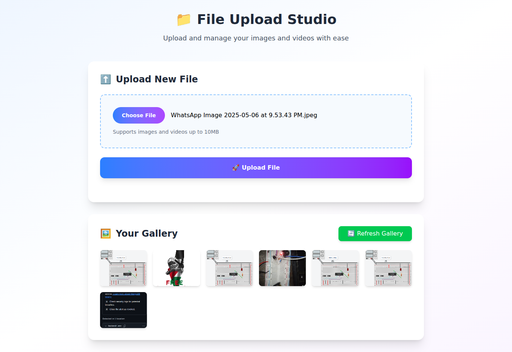

# 📁 File Upload S3 POC

A modern, responsive file upload application built with React, TypeScript, and AWS S3. This proof-of-concept demonstrates secure file uploading, preview functionality, and gallery management with a beautiful user interface.



## ✨ Features

- 🔒 **Secure S3 Upload** - Server-side signed URLs for secure file uploads
- 🖼️ **File Preview** - Real-time preview for images and videos
- 🎬 **Video Support** - Native video player with controls
- 🗂️ **Gallery Management** - View and delete uploaded files
- 📱 **Responsive Design** - Beautiful UI that works on all devices
- ⚡ **Fast Performance** - Optimized with Vite and modern React
- 🛡️ **Type Safety** - Full TypeScript implementation
- 🎨 **Modern UI** - Styled with Tailwind CSS and gradient designs

## 🛠️ Tech Stack

### Frontend
- **React 19** - Latest React with concurrent features
- **TypeScript** - Full type safety
- **Vite** - Fast build tool and dev server
- **Tailwind CSS 4** - Modern utility-first CSS framework

### Backend/Cloud
- **AWS S3** - File storage and management
- **AWS SDK v3** - Modern AWS client library
- **Signed URLs** - Secure, time-limited upload links

### Development
- **ESLint** - Code linting and quality
- **Node.js Types** - Full Node.js type support

## 📁 Project Structure

```
src/
├── components/           # Reusable UI components
│   ├── Header.tsx       # App header with title
│   ├── Layout.tsx       # Main layout wrapper
│   ├── FileUpload.tsx   # File upload form component
│   ├── FilePreview.tsx  # Image/video preview component
│   ├── Gallery.tsx      # File gallery with grid layout
│   └── index.ts         # Component exports
├── hooks/               # Custom React hooks
│   ├── useFileUpload.ts # Main file upload logic
│   └── index.ts         # Hook exports
├── utils/               # Utility functions
│   ├── fileUtils.ts     # File validation and checksum
│   └── index.ts         # Utility exports
├── types/               # TypeScript type definitions
│   └── index.ts         # Common interfaces
├── actions.ts           # AWS S3 server actions
├── App.tsx             # Main application component
└── main.tsx            # React app entry point
```

## 🚀 Getting Started

### Prerequisites
- Node.js 18+ 
- AWS Account with S3 bucket
- AWS IAM user with S3 permissions

### Installation

1. **Clone the repository**
   ```bash
   git clone <repository-url>
   cd file-upload-s3-poc
   ```

2. **Install dependencies**
   ```bash
   bun install
   ```

3. **Environment Setup**
   Create a `.env` file in the root directory:
   ```env
   AWS_BUCKET_NAME=your-bucket-name
   AWS_BUCKET_REGION=your-region
   AWS_ACCESS_KEY=your-access-key
   AWS_SECRET_ACCESS_KEY=your-secret-key
   ```

4. **Start development server**
   ```bash
   bun run dev
   ```

5. **Open your browser**
   Navigate to `http://localhost:5173`

## 🔧 Available Scripts

- `bun run dev` - Start development server
- `bun run build` - Build for production
- `bun run preview` - Preview production build
- `bun run lint` - Run ESLint

## 🔐 AWS Configuration

### S3 Bucket Setup
1. Create an S3 bucket in your AWS console
2. Configure bucket permissions for your use case
3. Note the bucket name and region

### IAM Permissions
Your AWS user needs these S3 permissions:
```json
{
  "Version": "2012-10-17",
  "Statement": [
    {
      "Effect": "Allow",
      "Action": [
        "s3:PutObject",
        "s3:GetObject",
        "s3:DeleteObject",
        "s3:ListBucket",
        "s3:HeadObject"
      ],
      "Resource": [
        "arn:aws:s3:::your-bucket-name",
        "arn:aws:s3:::your-bucket-name/*"
      ]
    }
  ]
}
```

## 📋 Supported File Types

### Images
- JPEG/JPG
- PNG
- GIF
- WebP
- BMP
- SVG

### Videos
- MP4
- WebM
- OGG
- AVI
- MOV
- WMV

**File Size Limit:** 10MB per file

## 🏗️ Architecture

### Component Architecture
- **Modular Design** - Each component has a single responsibility
- **Custom Hooks** - Business logic separated from UI components
- **Type Safety** - Comprehensive TypeScript interfaces
- **Error Handling** - Graceful error states and user feedback

### Security Features
- **Server-side Signed URLs** - No client-side AWS credentials
- **File Validation** - Size and type checking
- **Checksum Verification** - SHA-256 file integrity
- **Environment Variables** - Secure credential management

### Performance Optimizations
- **Vite Build Tool** - Fast development and optimized builds
- **Tree Shaking** - Only bundle used code
- **Lazy Loading** - Efficient resource loading
- **Modern React** - Concurrent features and optimizations

## 🎨 UI/UX Features

- **Gradient Backgrounds** - Modern visual design
- **Hover Effects** - Interactive element feedback
- **Loading States** - Clear upload progress indication
- **Error Messages** - User-friendly error handling
- **Responsive Grid** - Adaptive gallery layout
- **Smooth Animations** - Enhanced user experience

## 🔄 How It Works

1. **File Selection** - User selects a file through the upload form
2. **Client Validation** - File type and size validation on the client
3. **Checksum Generation** - SHA-256 hash created for file integrity
4. **Signed URL Request** - Server generates secure S3 upload URL
5. **Direct Upload** - File uploaded directly to S3 via signed URL
6. **Gallery Update** - UI refreshes to show the new file

## 🤝 Contributing

1. Fork the repository
2. Create a feature branch (`git checkout -b feature/amazing-feature`)
3. Commit your changes (`git commit -m 'Add amazing feature'`)
4. Push to the branch (`git push origin feature/amazing-feature`)
5. Open a Pull Request

## 📄 License

This project is licensed under the MIT License - see the [LICENSE](LICENSE) file for details.

---

**Built with ❤️ by Tajwar**
